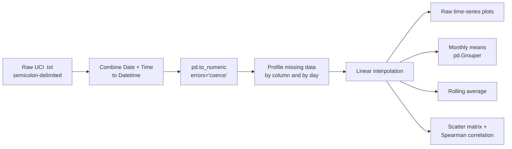

# Household Power Time Series: Data Cleaning & EDA

**Cleaning and exploring 2M+ minute-level IoT smart-meter readings from one household over four years.**

## Overview

This is a graduate course lab for **AAI-530 (IoT)** in the M.S. in Applied Artificial Intelligence program at the University of San Diego. It is the first of three labs that use the same smart-meter dataset:

1. **Cleaning & EDA** (this repo)
2. [Linear regression for streaming prediction](https://github.com/oxayavongsa/aai-iot-linear-regression)
3. [LSTM forecasting](https://github.com/oxayavongsa/aai-iot-lstm)

The notebook loads the raw UCI file, fixes data types, imputes missing readings, and uses time-series visualizations and a correlation analysis to decide which signals matter for later forecasting work.

## Key results

All figures below come from the executed notebook outputs.

| Metric | Value |
|---|---|
| Raw minute-level rows | **2,075,259** (16 Dec 2006 to 26 Nov 2010) |
| Rows with unparseable / missing readings (`?`) | **25,979** (all 7 numeric columns) |
| Missing values after linear interpolation | **0** |
| Mean Global Active Power (after cleaning) | **1.090 kW** (max 11.122 kW) |
| Mean voltage | **240.83 V** (range 223.2 to 254.15 V) |
| Monthly averages computed | **48** months |

**What the data showed**
- **Strong seasonality.** Monthly mean active power peaks in winter (1.90 kW in Dec 2006, 1.63 kW in Dec 2007) and drops in summer (0.67 kW in Jul 2007, 0.62 kW in Jul 2009). August 2008 is an outlier at 0.28 kW.
- **Redundant features.** Global active power and global intensity move almost in lockstep (Spearman scatter matrix), which flags a multicollinearity risk for downstream models.
- **Voltage behaves independently.** It is weakly and negatively related to load, so it may add separate signal.
- **Aggregation is needed.** Plotting the raw minute-level data hides the trends. Monthly means and rolling averages reveal them.

## Approach

- **Type normalization:** combined `Date` and `Time` (day-first format) into a single `Datetime`, then coerced the measurement columns from `object` to `float64`.
- **Missing data:** missing values were plotted per day and turned out to be sporadic gaps rather than long outages. Linear interpolation was used to keep the series continuous instead of dropping rows.
- **Visualization:** raw line charts of four variables, monthly averages (`pd.Grouper(freq='ME')`) and a rolling-mean smoother.
- **Correlation:** scatter matrix of the four global power variables, annotated with Spearman coefficients.

## Dataset

[Individual Household Electric Power Consumption](https://archive.ics.uci.edu/ml/datasets/Individual+household+electric+power+consumption) from the UCI Machine Learning Repository. The data contains one-minute readings from a single household in France covering active and reactive power, voltage, current intensity and three sub-meters. The dataset is **not** included in this repo; download it from UCI.

## Tech stack

Python 3.12 · pandas · NumPy · Matplotlib · seaborn · Jupyter / Google Colab

## Repository structure

| File | Description |
|---|---|
| [`O_Xayavongsa_Cleaning_&_EDA_Assignment_.ipynb`](O_Xayavongsa_Cleaning_%26_EDA_Assignment_.ipynb) | Completed notebook with code, outputs, charts and written analysis |
| [`Cleaning & EDA Assignment .ipynb`](Cleaning%20%26%20EDA%20Assignment%20.ipynb) | Original assignment template (not executed) |
| `README.md` | This file |

## How to run

1. Download `individual+household+electric+power+consumption.zip` from the UCI link above.
2. Open [`O_Xayavongsa_Cleaning_&_EDA_Assignment_.ipynb`](O_Xayavongsa_Cleaning_%26_EDA_Assignment_.ipynb) in Google Colab (the notebook has an "Open in Colab" badge) or in local Jupyter.
3. If you run it in Colab, set `zip_file_path` to your Drive location. If you run it locally, remove the `google.colab` drive-mount cell and point `data_file_path` at the extracted `household_power_consumption.txt`.
4. Install the dependencies with `pip install pandas numpy matplotlib seaborn`, then run all cells. The full 2M-row file needs a few GB of RAM.

> **Note:** the "30-day" rolling-average cell sets `rolling_window = 30*24*60//60`, which is 720 samples. At one-minute resolution that is a 12-hour window. For a true 30-day window, use `df.rolling('30D', on='Datetime')`.

## Acknowledgments

The assignment template was provided by the course instructor ([amarbut/aai-iot-cleaning-and-eda](https://github.com/amarbut/aai-iot-cleaning-and-eda)). The dataset is by Georges Hébrail and Alice Bérard, via the UCI ML Repository.

---

**Outhai (Thai) Xayavongsa** · M.S. Applied Artificial Intelligence (University of San Diego) · MBA

[GitHub](https://github.com/oxayavongsa) · [Portfolio](https://oxayavongsa.github.io/ai-automation-portfolio/)

